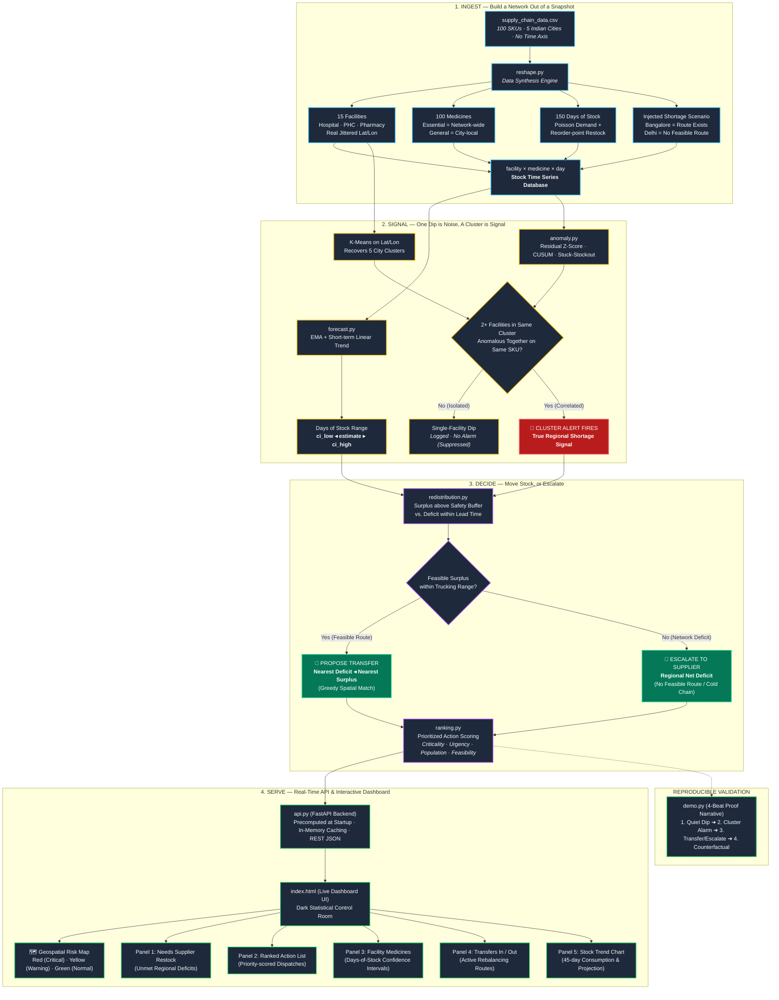

<div align="center">

# 🌊 RIPPLE
### Regional Medicine Shortage Detection & Redistribution System

**Treating medicine stockouts as a network problem, not a single-facility emergency.**

[](https://ripplehackathon.dpdns.org/)
[](https://github.com/4rch1t/ripple)
[](https://www.python.org/)
[](https://fastapi.tiangolo.com/)
[](LICENSE)
[](https://sdgs.un.org/goals/goal3)

---

[**Explore Live Dashboard**](https://ripplehackathon.dpdns.org/) • [**System Architecture**](#-system-architecture) • [**Core Philosophy**](#-the-core-philosophy) • [**Algorithmic Pipeline**](#-pipeline-architecture--modules) • [**4-Beat Proof Demo**](#-the-reproducible-4-beat-proof) • [**API Reference**](#-api-reference)

---

</div>

## 📌 Executive Summary

Real-world healthcare supply chains fail because they treat stockouts as isolated point incidents. By the time a local Primary Health Centre (PHC) or hospital clinic runs completely out of an essential antibiotic or analgesic, patients are already turned away and emergency procurement is both costly and slow.

**Ripple** is an intelligent, early-warning supply chain network intelligence platform designed around one foundational insight:
> **One low facility is noise; several nearby facilities running low on the same medicine at the same time is signal.**

By analyzing consumption velocity, confidence-bounded stock runways, and geospatial clustering, Ripple catches emerging regional shortages **days before facilities hit zero**. It then automatically computes optimal peer-to-peer truck redistributions from facilities with verifiable surplus—or immediately triggers **Supplier Escalations** when regional net deficits render transfers mathematically unfeasible.

---

## 🏛️ System Architecture

The following diagram illustrates Ripple's end-to-end processing pipeline—from raw snapshot ingestion and stochastic time-series synthesis, through dual-layer statistical anomaly detection, to linear optimization and real-time dashboard serving:



---

## 🎯 The Core Philosophy

| Traditional Facility Monitoring | The Ripple Paradigm |
| :--- | :--- |
| **Reactive**: Reacts when inventory hits absolute zero. | **Predictive**: Detects coordinated downward consumption velocity days ahead. |
| **Siloed**: Each hospital/clinic manages its own restock. | **Network-Centric**: Solves multi-facility supply balances over feasible road networks. |
| **Point Estimates**: False precision ("Runs out in exactly 4.2 days"). | **Explicit Uncertainty**: Always carries confidence intervals (`ci_low` ◂ `estimate` ▸ `ci_high`). |
| **Binary Panic**: All stockouts trigger expensive emergency supplier orders. | **Dual Resolution**: Matches local surplus first; only escalates when regional capacity is exceeded. |
| **False-Alarm Heavy**: Natural consumption spikes create alert fatigue. | **Noise-Resistant**: Single-facility dips are suppressed; only correlated cluster dips alert. |

---

## 📊 The Data Foundation & Realism Caveat

### The Source Data
The workspace originates from a real supply chain snapshot (`supply_chain_data.csv`) containing 100 rows, one per product SKU, mapped across 5 major Indian metropolitan hubs: **Mumbai, Kolkata, Delhi, Bangalore, and Chennai**.

### The Transformation (`reshape.py`)
Because the source dataset lacked timestamps, multi-facility distribution, and geographic coordinates, `reshape.py` converts the raw snapshot into an enterprise-grade epidemiological supply network:

1. **15 Structured Healthcare Facilities**:
   - Each of the 5 cities is split into three realistic tiers: a **Hospital**, a **Primary Health Centre (PHC)**, and a **Retail Pharmacy**.
   - Nodes are mapped to real geographical coordinates with realistic spatial jitter.
2. **100 Realistic SKU Mappings**:
   - SKUs are classified into clinically recognizable drugs (e.g., *Amoxicillin, Paracetamol, Artemether-Lumefantrine, Ibuprofen, Tramadol, Cefixime*).
   - **Essential Medicines**: Stocked at all 15 facilities (national supply network).
   - **General Medicines**: Maintained locally within their origin city's 3 facilities.
3. **150-Day Daily Inventory Time-Series**:
   - Simulated forward via **Poisson-distributed daily consumption** combined with **(s, S) reorder-point replenishment**.
   - Initialized directly from the source dataset's empirical SKU parameters (lead times, defect rates, unit prices, order quantities).
4. **Disclosed Benchmark Scenarios**:
   - **Bangalore Cluster (Hero Scenario)**: A coordinated demand surge is injected across Bangalore facilities. A feasible redistribution partner exists in nearby **Chennai** (~270 km), demonstrating an inter-facility rebalancing transfer.
   - **Delhi Cluster (Counterpoint Scenario)**: A severe surge is injected into the isolated Delhi cluster. With no surplus facilities within viable trucking radius, the system validates the **Supplier Escalation** fail-safe.

---

## ⚙️ Pipeline Architecture & Modules

The core algorithmic intelligence lives in `src/` as modular, explainable pipelines:

```
src/
├── config.py           # Network constants, safety buffers, trucking speed & thresholds
├── reshape.py          # Ingestion & 150-day time-series simulation engine
├── forecast.py         # Rolling EMA + trend forecasting with confidence intervals
├── anomaly.py          # Z-Score, CUSUM, stuck-stockout detection & K-Means clustering
├── redistribution.py   # Surplus/deficit optimization & greedy transportation solver
├── ranking.py          # Multi-attribute priority scoring & human-readable narratives
├── demo.py             # Reproducible 4-beat end-to-end proof narrative
└── api.py              # High-performance FastAPI backend & static UI server
```

### 1. `forecast.py` — Days-of-Stock with Explicit Uncertainty
- Calculates trend-adjusted daily burn rates using **Exponential Moving Average (EMA)** smoothing.
- Fits a short-term linear trend over recent consumption history.
- Derives days-of-stock as a bounded range:
  $$\text{Days of Stock} = \frac{\text{Current Stock Level}}{\text{Trend-Adjusted Consumption Rate}}$$
- Quantifies residual variance to deliver `[ci_low, estimate, ci_high]`, preventing false precision.

### 2. `anomaly.py` — Cluster-Level Signal Extraction
- **Residual Z-Score & CUSUM**: Flags when a facility's burn rate significantly departs from its empirical historical baseline.
- **Stuck-Stockout Detection**: Uncovers hidden stockouts where consumption drops to zero simply because there is nothing left to dispense.
- **Geospatial K-Means**: Partitions facilities by latitude/longitude.
- **Correlated Alerting**: An alert is only promoted to a **Cluster Alert** when $\ge 2$ facilities within the same geographic cluster exhibit simultaneous anomalies for the identical SKU.

### 3. `redistribution.py` — Greedy Transport Solver
- **Facility Surplus**: Computes available stock strictly above the facility's local safety buffer:
  $$\text{Surplus} = \max(0, \text{Stock} - (\text{Burn Rate} \times \text{Safety Buffer Days}))$$
- **Facility Deficit**: Calculates expected stock shortfalls within the supplier lead-time window.
- **Feasible Route Matching**: Greedily assigns nearest deficit to nearest surplus within a max feasible trucking range (accounting for road conditions and travel time).
- **Supplier Escalation**: SKUs with unmet deficits across disconnected or fully depleted clusters are tagged as **Regional Net Deficits**, triggering direct supplier purchase orders.

### 4. `ranking.py` — Action Prioritization Engine
Every event is ranked using a composite priority score:
$$\text{Priority Score} = w_1 \cdot \text{Criticality} + w_2 \cdot \text{Urgency} + w_3 \cdot \text{Population} + w_4 \cdot \text{Feasibility}$$
Generates human-readable dispatches such as:
> *"Bangalore Hospital (and 2 nearby facilities) will stock out of Amoxicillin in ~3 days (2–14 day range); MAA-PHARM has surplus 270km away; recommend transferring 3 units. 2 facilities have no feasible transfer — escalate to supplier."*

---

## 🎬 The Reproducible 4-Beat Proof

Run `python demo.py` to observe Ripple's live algorithmic decision pipeline without hardcoded smoke-and-mirrors:

```
======================================================================
BEAT 1 -- A single facility's stock dips (Normal variance, no alarm)
======================================================================
BLR-HOSP / Amoxicillin (SKU00): days_of_stock=11.2 (8.4 - 15.1)
Cluster-level alert for Bangalore/SKU00 at this point:
NONE -- within normal variance, system stays quiet. (Suppresses false alarms)

======================================================================
BEAT 2 -- Nearby facilities dip together, cluster-level alert fires
======================================================================
cluster_id=3  sku=SKU00 (Amoxicillin)
contributing facilities: ['BLR-HOSP', 'BLR-PHC', 'BLR-PHARM']
TREND: 3 facilities in Bangalore cluster trending toward stockout together.

======================================================================
BEAT 3 -- System proposes specific transfer & supplier escalation
======================================================================
PROPOSED TRANSFER:
MAA-PHARM -> BLR-HOSP: 3.2 units of SKU00 (Amoxicillin) | Distance: 270.7 km

COUNTERPOINT (Delhi Cluster / Diclofenac):
No facility within feasible trucking radius has surplus stock.
-> REGIONAL NET DEFICIT: 180 units unmet across 3 facilities.
   Flagged for SUPPLIER ESCALATION, not redistribution.

======================================================================
BEAT 4 -- Counterfactual: projected outcome if no action is taken
======================================================================
BLR-HOSP projects 1.4 days of stock remaining if no transfer occurs.
With the proposed transfer of 3.2 units, runway extends by +5.8 days.
Delhi's stockout persists until next supplier manufacturing cycle.
```

---

## 🖥️ Interactive Dashboard Interface

The web interface is an uncluttered, high-contrast, dark-mode statistical command center served directly by FastAPI and Leaflet.js:

```
┌─────────────────────────────────────────────────────────────────────────────────┐
│  RIPPLE   [● Critical: BLR-HOSP]                  [How It Works]  [How To Read] │
├──────────────────────────────────────┬──────────────────────────────────────────┤
│                                      │  ⚠ NEEDS SUPPLIER RESTOCK                │
│  🗺️ GEOSPATIAL RISK MAP              │  • Vitamin C: 350 units short (Delhi)    │
│                                      │  • Ampicillin: 181 units short (Delhi)   │
│  [Square dot per facility:           ├──────────────────────────────────────────┤
│   Red = Critical (<2d / cluster alert)│  📋 RANKED ACTION LIST                   │
│   Yellow = Warning (2-7d)            │  [1] Amoxicillin (Score: 0.983)          │
│   Green = Normal (>7d)]              │      BLR-HOSP: Transfer 3.2u from MAA    │
│                                      │  [2] Paracetamol (Score: 0.932)          │
├──────────────────────────────────────┼──────────────────────────────────────────┤
│  📈 STOCK TREND (Historical + Range) │  📦 TRANSFERS IN / OUT                   │
│  [45-day daily burn curve with       │  • IN: 3.2u Amoxicillin from MAA-PHARM   │
│   confidence boundary overlay]       │  • IN: 41.4u Paracetamol from MAA-HOSP   │
│                                      ├──────────────────────────────────────────┤
│                                      │  💊 FACILITY MEDICINES                   │
│                                      │  • SKU00 (Amoxicillin): 1.4d [1.2-1.9]   │
│                                      │  • SKU71 (Paracetamol): 1.8d [1.5-3.2]   │
└──────────────────────────────────────┴──────────────────────────────────────────┘
```

- **One-Click Reactive Cross-Filtering**: Clicking any facility dot on the map or an alert item in Panels 1 & 2 instantly isolates and repopulates that facility’s active medicines, inbound/outbound transfer dispatches, and 45-day stock time-series chart.
- **Transparent Methodology**: Header modals break down statistical z-score formulas, lead-time thresholds, and confidence intervals for end users.

---

## 🚀 Getting Started

### Prerequisites
- Python 3.11+
- `pip` or `conda`

### Local Installation

1. **Clone the repository**:
   ```bash
   git clone https://github.com/4rch1t/ripple.git
   cd ripple
   ```

2. **Create and activate a virtual environment**:
   ```bash
   # On macOS/Linux:
   python3 -m venv .venv
   source .venv/bin/activate

   # On Windows (PowerShell):
   python -m venv .venv
   .venv\Scripts\Activate.ps1
   ```

3. **Install dependencies**:
   ```bash
   pip install -r requirements.txt
   ```

4. **Launch the FastAPI Server**:
   ```bash
   cd src
   uvicorn api:app --host 127.0.0.1 --port 8000 --reload
   ```
   Open `http://127.0.0.1:8000` in your web browser.

---

## 🛠️ Standalone Pipeline Verification

You can execute every phase of the pipeline independently from within the `src/` directory:

```bash
cd src

# 1. Regenerate 150-day simulated dataset & routes
python reshape.py

# 2. Compute Days-of-Stock ranges across all facilities
python forecast.py

# 3. Detect anomalies and evaluate geographic cluster alerts
python anomaly.py

# 4. Run the greedy redistribution matching & supplier escalation flags
python redistribution.py

# 5. Build prioritized recommendations
python ranking.py

# 6. Execute the full reproducible 4-beat narrative
python demo.py
```

---

## 🐳 Docker Deployment

Ripple is fully containerized and production-ready:

```bash
# Build the Docker image
docker build -t ripple-app .

# Run the container
docker run -d -p 8000:8000 --name ripple-instance ripple-app
```
Access the application at `http://localhost:8000`.

---

## 🔌 API Reference

| Method | Endpoint | Description |
| :--- | :--- | :--- |
| `GET` | `/api/facilities` | Returns all 15 facilities with computed risk tiers (`critical`, `warning`, `normal`) and coordinates. |
| `GET` | `/api/routes` | Returns transit routes between facilities, travel distances (km), and road feasibility flags. |
| `GET` | `/api/recommendations` | Complete ranked action list with priority scores, contributing clusters, and proposed transfers. |
| `GET` | `/api/regional-deficits` | SKUs suffering regional net deficits requiring direct supplier replenishment. |
| `GET` | `/api/facility/{id}` | Detailed facility dossier: stock levels, days-of-stock ranges, incoming and outgoing transfers. |
| `GET` | `/api/trend/{id}/{sku}` | 45-day historical stock, consumption time-series, and forward-looking forecast bounds. |

---

## 👥 The Team & Contributions

This project was engineered for the hackathon by:

* **Archit** — [@4rch1t](https://github.com/4rch1t)
* **Aarav Goel** — [@coderaarav12](https://github.com/coderaarav12)
* **Anand** — [@cyberrrbreach](https://github.com/cyberrrbreach)
* **Neeti** — [@neetii-git](https://github.com/neetii-git)
* **Krishav Dutta**

---

<div align="center">
  <sub>Built with ❤️ for resilient public health systems and UN Sustainable Development Goal 3.</sub>
</div>

